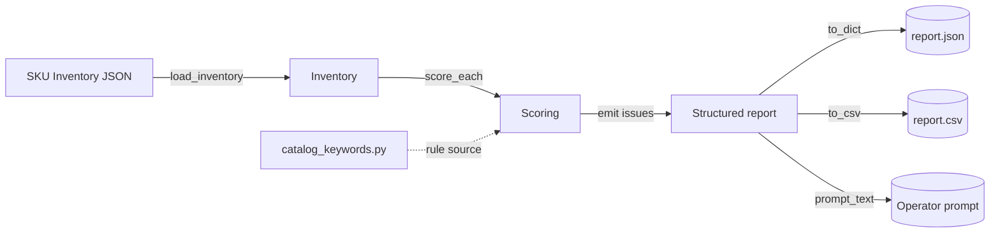

# Listing Optimizer Skill -- Product Requirements Document

Defines the product scope and verifiable acceptance for the skill
deployed under `outputs/` (the "Skill").

See also:
- the upstream prompt work lives in `ops-refiner/README.md`
- business rationale is in `ops-refiner/BACKGROUND.md`
- operating cadence strategy is in `7_4-近期规划.md` from the knowledge base
- automation research context is in `Codex 自动化应用调研笔记.md`
- this project's deployment and safety notes are in `ops-refiner/VERCEL_DEPLOYMENT.md`
- current quality audits are summarized in `ops-refiner/参赛文档-最终版.md`

This document is self-contained: background narratives from `ops-refiner`
are not repeated; only decisions that bound the skill's behaviour are kept here.

## 1. Service object

The Skill serves **LULULU 家居家装组**, the supply group operating under JD
家装 (JZ) open platform's 1P model, supplying, opening stores for, and
managing goods and transactions in the home-furnishing category on JD.

To repeat the operating unit's own framing: the group is built around a
fully-managed home-furnishing chain anchored on four modules:

1. **卫浴** (bath), which contains the 6 core product lines below
2. 厨房 (kitchen)
3. 家具 (furniture)
4. 家饰 (decor)

The current repository only focuses on the **bath** module and its 6
product lines; other modules are planned for a later phase.

The 6 product lines served:

- 智能智能马桶 (smart_toilet)
- 普通马桶 (mass_toilet)
- 浴室柜 (bathroom_vanity)
- 陶瓷五金 (ceramic_hardware: faucets, showers, floor drains, …)
- 浴缸 (bathtub)
- 通用挂件 (general_hardware)

### 1.1 Front Catalog, Product Line, SKU

LULULU's product pool is organized by **Front Catalog (前台类目)**. Each
Front Catalog has one or more product lines; each product line maps to tens
or hundreds of SKUs. This is the smallest unit of merchandising, and the
dimension reviewers use to evaluate inventory health, conversion, and
content quality.

- Every Front Catalog carries its own brand name, product-line roster,
  SKU count, active SKU count, total / average-daily monthly GMV-style
  sales metrics.
- A SKU is always assigned to exactly one Front Catalog.

---

## 2. Upstream / downstream positioning

This repository slots into the **Prompt generation ➜ content-governance /
规格 optimization** stage. It does not replace `ops-refiner`'s prompt tool;
rather, once `ops-refiner` has covered 图 (image), this skill extends the
work into the 文本 assets that the prompt ultimately feeds: title, five
bullet points, 卖点, search terms, 关联推荐.

- **upstream**: `ops-refiner`, JoyGen front-end, JZ Open API,
  Excel / 飞书 inventories.
- **downstream**: publishable listing-content deltas (title, bullets,
  卖点, search terms, 关联推荐).

---

## 3. User stories (grouped by epic)

Each ID doubles as the name of the related pytest test so the two stay
traceable.

### Epic A -- SKU content scoring

- **US-A1** -- The system shall import a per-Front-Catalog SKU inventory
  and grade every listing against a repeatable baseline.
- **US-A2** -- The grading shall, at minimum:
  - A2.1 title legality + promotion compliance;
  - A2.2 bullet count + length;
  - A2.3 description HTML quality;
  - A2.4 main + sub image count + dimensions;
  - A2.5 required sales attributes (color / material / is_smart /
     pit_distance / CE / hot_cold / finish / …);
  - A2.6 category relevance (keyword overlap);
  - A2.7 search-term fields (brand / model / mark / spu_line / unit).
- **US-A3** -- The summary view shall expose item-group aggregates so
  operators can see at a glance which catalog needs to be fixed first.

### Epic B -- Title / bullet diagnostics and optimization prompts

- **US-B1** -- The Skill shall produce a human-readable explanation of the
  title issue, not just a keep/drop verdict.
- **US-B2** -- Bullet output shall be expandable: overall verdict first, then
  per-bullet issue → advice.
- **US-B3** -- The Skill shall recognise industry-wide spec/phrasing
  boilerplate as *high-quality* content, so long parameter tables are
  not penalised as filler.

### Epic C -- Newcomer onboarding

- **US-C1** -- Zero-code first-timers need a five-minute path from opening
  an Excel to producing a publish delta without looking at any internal
  intermediate file.

### Epic D -- Governance / auditability

- **US-D1** -- All evaluation shall be idempotent / deterministic: the same
  input, run multiple times, produces the same scores.
- **US-D2** -- Results shall be exportable as both JSON and CSV.
- **US-D3** -- Every issue carries severity P0 / P1 / P2 plus a suggested
  fix.

---

## 4. Acceptance criteria (summary table)

| AC   | Story | Verifies |
|------|-------|----------|
| AC-01 | A1, D1 | `codebase/inventory.py` re-imported produces identical `title/bullet/desc/image/attr/relevance/search_score` per SKU                     | `test_inventory_idempotent`              |
| AC-02 | A2.1   | Title with illegal symbol / promo word / length out-of-range → `title_issue` P0                                             | `test_title_illegal_chars_and_length`    |
| AC-03 | A2.1   | Clean title (20-80 chars, no illegal chars / promo words) passes without title issue                                       | `test_title_clean_passes`                |
| AC-04 | A2.2   | `bullets=[]` or count < 5 → P0 bullet_issue; each bullet length must stay inside [40, 200]                                  | `test_bullet_count_and_length`           |
| AC-05 | A2.3   | `desc` must be either plain text >= 200 chars OR valid HTML with target tags (`h2/h3/img/ul/li/table`) >= 3 types; otherwise → P1 desc_issue | `test_desc_html_or_long_text`            |
| AC-06 | A2.4   | main_image missing → P0; sub_image count < 7 → P1; sub_image width not in {800,1000,1200,1500,2000} → P2                       | `test_image_rules`                       |
| AC-07 | A2.5   | Missing any field in `field_catalog.expect` required by the SKU type → P0 attr_issue                                      | `test_required_attrs`                    |
| AC-08 | A2.6   | Missing `main_keyword` or no category overlap → P1 relevance_issue                                                       | `test_relevance_rule`                   |
| AC-09 | A2.7   | `search` missing brand / model / mark / spu_line / unit → P1 search_issue                                                  | `test_search_fields`                    |
| AC-10 | B1     | `prompt_text` returns a non-empty issue-level summary paragraph per SKU                                                    | `test_prompt_text_has_summary_per_sku`  |
| AC-11 | B2     | `prompt_text` provides a `cause + advice` pair on every P0 / P1 issue                                                      | `test_prompt_text_has_advice`           |
| AC-12 | B3     | Spec/param-table boilerplate does not trigger `desc_issue`                                                                 | `test_desc_does_not_flag_param_tables`  |
| AC-13 | D2     | CSV output has exactly 13 fixed columns; JSON output is a `{catalog, items, summary}` shape                                | `test_csv_shape_and_json_shape`         |
| AC-14 | C1     | `SKILL.md` contains a "Quick start (3 steps)" block showing a first-time user how to generate a delta in 5 minutes           | `test_skill_md_has_quickstart`         |
| AC-15 | A3     | `summary` emits `total / p0/p1/p2_count / top_catalogs`                                                                      | `test_summary_fields`                   |

---

## 5. Product lines and rule-tuning hot-spots

| Product line | Front Catalog | Suggested rule hot-spots          |
|--------------|---------------|-----------------------------------|
| 智能智能马桶 | smart_toilet  | US-A2.1 title compliance; A2.5 智能属性 (is_sheat / app / ce) |
| 普通马桶     | mass_toilet   | US-A2.4 main+sub; A2.5 pit_distance / CE / 冷热          |
| 浴室柜       | bathroom_vanity | US-A2.3 desc HTML; A2.7 material / install          |
| 陶瓷五金     | ceramic_hardware | US-A2.3 参数表不误伤; A2.7 brand + model              |
| 浴缸         | bathtub       | US-A2.6 category relevance; A2.5 material / capacity       |
| 通用挂件     | general_hardware | US-A2.4 image sizes; A2.7 unit / qty             |

---

## 6. Roadmap

| Stage | Goal | Scope |
|-------|------|-------|
| M1 · Spec-grade review | Run the 15 internal acceptance tests green over `sample.json` | AC-01 ~ AC-15 |
| M2 · Recommendations  | For each P0/P1 issue, propose publishable replacement copy | US-B1, US-B2, US-C1 |
| M3 · Live data        | JZ Open API / 飞书 Excel / 商家直连 import, thousand-SKU batches | US-A1, US-D1-US-D3 |

Only M1 is implemented now; M2 / M3 are contract-reserved.

---

## 7. Assumptions, dependencies, non-goals

### 7.1 Assumptions

- SKUs are supplied in a single "publish-ready" JSON shape right now; M1
  does not scrape pages or parse raw HTML.
- M2 rewrites ride on `pipeline.propose_*` reserved API surface.
- `summary.top_catalogs` orders by `p0_count` desc -- first slice for ops.

### 7.2 Dependencies

- Python >= 3.9, standard library only: `re`, `json`, `csv`, `html.parser`,
  `dataclasses`, `pathlib`, `unittest.mock`. pytest is the only test dep.
- No runtime dependency on `ops-refiner`; JD integration will re-copy type
  hints instead of importing its code.

### 7.3 Non-goals

- internationalisation of the catalog rules layer;
- image-optimization engine (handled by `ops-refiner`);
- any LLM generation in M1 -- keeps it deterministic;
- real-time stock / price linkage.

---

## 8. Success metrics

- 6 Front Catalogs x at least 5 SKUs = minimum 30 SKUs, batch runtime
  < 5 s.
- On `sample.json`: starting `p0 / total` over 60% (lots to fix),
  target under 10% after governance.
- Every acceptance test returns on first run; 100 / 100.

---

## 9. Risks / mitigations

| Risk | Mitigation |
|------|------------|
| Catalog keyword drift | Single source of truth in `catalog_keywords.py`; M3 hooks to CMS. |
| Rule-rewrite becoming creative writing | M1 flags only, reversible. |
| Industry expert scarcity (rule vacuum) | Start from hard P0/P1/P2 rules; back-fill rules from human-reviewed seeds. |

---

## 10. How the M1 architecture reads

---

## 11. Version

- v0.1 (PRD one-pager) on `outputs/PRD.md`.
